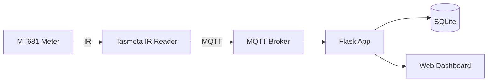

 # Energy Monitor

Real-time energy monitoring dashboard for smart meters. Collects power and energy data via MQTT from a Tasmota-flashed IR reading head connected to an MT681 smart meter.

## Screenshot

<!-- Add screenshot here -->


## Architecture



## Hardware

- [Stromleser WiFi Smart Meter IR Reading Head](https://www.amazon.de/-/en/dp/B0DJP2MDLK) (Tasmota-flashed)
- MT681 smart meter (or compatible)

## Requirements

- Python 3.12+
- Poetry
- MQTT broker (e.g., Mosquitto)

## Installation

```bash
git clone <repo-url>
cd energy-monitor

poetry install
python database.py  # initialize db
```

## Configuration

Set the following environment variables (or edit `values.py`):

| Variable | Description | Default |
|----------|-------------|---------|
| `DATABASE_URL` | SQLAlchemy connection string | `sqlite:///data/energy.db` |
| `MQTT_PORT` | MQTT broker port | `1883` |
| `SERVER_URL` | Server hostname/IP | `localhost` |
| `FLASK_PORT` | Web server port | `5000` |
| `TOPIC` | MQTT topic to subscribe | `tele/tasmota/SENSOR` |

## Usage

```bash
poetry run python app.py
```

Open `http://localhost:5000` in your browser.

## API Endpoints

| Endpoint | Description |
|----------|-------------|
| `GET /` | Web dashboard |
| `GET /api/readings` | Fetch readings (params: `start`, `end`) |
| `GET /api/latest_reading` | Get most recent reading |
| `GET /api/stats` | Get statistics for a time range |
| `GET /status` | Service health and info |

#### Helpful commands for me:
 ```bash
 # Sync Laptop to RaspberryPi
 black .  && isort . && rsync -av --exclude 'data/' . mnalavadi@192.168.2.107:/home/mnalavadi/energy_monitor

# Sync Raspberry Pi DB to local
rsync -av mnalavadi@192.168.2.107:/home/mnalavadi/energy_monitor/data/ ./data/


# Restart Raspberry service and stream logs
sudo systemctl restart projects_energy_monitor.service && journalctl -u projects_energy_monitor.service -f
```
